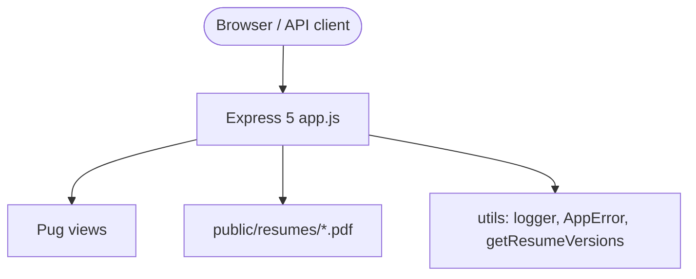
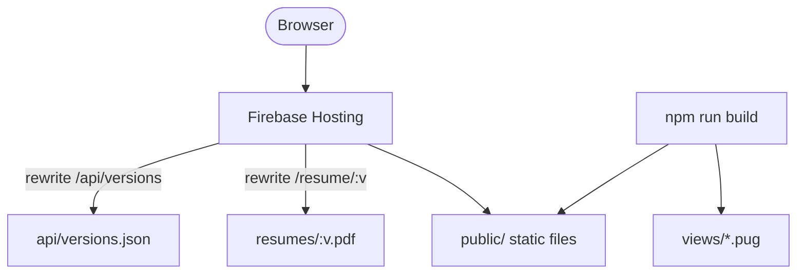

# Platform hardening, Firebase static build, Playwright usability & documentation

> **Type:** Major enhancement · **Risk:** Medium · **Breaking changes:** None for public URLs  
> **Author:** Jacob Son · **Reviewer focus:** Express routing, Firebase deploy, CI, security

---

## Executive summary

This PR transforms **Online-PDF-CV** from a minimal PDF-serving Express app with unresolved merge conflicts into a **production-ready resume platform** with:

- Structured logging & operational error handling
- Express 5 routing with security hardening
- Firebase static build (tools work in production without Node)
- Full test pyramid (Jest + Playwright)
- Published documentation, wiki source, screenshots & usability videos

| Metric               |                         Value |
| -------------------- | ----------------------------: |
| **Commits**          |                            12 |
| **Files changed**    |                           112 |
| **Lines added**      |                       +23,238 |
| **Lines removed**    |                        −1,739 |
| **Jest tests**       |                    22 passing |
| **Playwright tests** | 14 passing (desktop + mobile) |
| **npm audit**        |             0 vulnerabilities |
| **Package version**  |                       `3.6.2` |

---

## Metadata

| Field                | Value                                  |
| -------------------- | -------------------------------------- |
| **Package**          | `benyakoub-cv@3.6.2`                   |
| **License**          | Apache-2.0                             |
| **Node**             | `>=16.17.1`                            |
| **Live demo**        | https://benyakoub-cv.firebaseapp.com/  |
| **Firebase project** | `benyakoub-cv`                         |
| **Head branch**      | `benmed00:platform-hardening-and-docs` |
| **Base branch**      | `ben-git-code:master`                  |

---

## Before vs after comparison

| Area                 | Before (base)                                                 | After (this PR)                              |
| -------------------- | ------------------------------------------------------------- | -------------------------------------------- |
| **App state**        | Unresolved merge conflicts in `app.js`, `package.json`, views | Clean, buildable, tested codebase            |
| **Home page**        | Firebase boilerplate `index.html` OR raw PDF wildcard         | Pug home page with embedded PDF iframe       |
| **Production tools** | `/docs`, `/analyzer`, `/compare` only on Express locally      | Pre-rendered static HTML + Firebase rewrites |
| **Error handling**   | Broken `createError` reference, unreachable 404 handler       | `AppError` + hybrid JSON/HTML handler        |
| **Logging**          | `morgan` listed but unused                                    | Winston (console + file, auto `logs/`)       |
| **Security**         | No Helmet, path traversal on `/resume/:version`               | Helmet + CSP, slug validation `[a-z0-9-]+`   |
| **Testing**          | Partial / stub tests                                          | 22 Jest + 14 Playwright usability tests      |
| **CI**               | Triggered on `main` (wrong branch)                            | Runs on `master` + build + e2e job           |
| **Dependencies**     | 11 npm audit issues                                           | 0 vulnerabilities                            |
| **Documentation**    | Basic README                                                  | README gallery + 8 wiki pages + media assets |
| **Deploy**           | Empty `build` script                                          | `npm run build` → static site for Firebase   |

---

## Architecture

### Local development (Express)



### Production (Firebase Hosting)



### Request routing (Express)

| Method | Route              | Handler                        |
| ------ | ------------------ | ------------------------------ |
| `GET`  | `/`                | Home (Pug + PDF iframe)        |
| `GET`  | `/docs`            | API documentation              |
| `GET`  | `/analyzer`        | Resume keyword analyzer        |
| `GET`  | `/compare`         | Side-by-side PDF comparison    |
| `GET`  | `/api/versions`    | JSON version list              |
| `GET`  | `/resume`          | Default PDF                    |
| `GET`  | `/resume/:version` | Versioned PDF (validated slug) |

---

## What's new

### Features

| Feature               | Route / artifact           | Description                        |
| --------------------- | -------------------------- | ---------------------------------- |
| Multi-version resumes | `/resume/:version`         | Serve PDFs from `public/resumes/`  |
| Versions API          | `/api/versions`            | JSON list of available versions    |
| API docs page         | `/docs`                    | Interactive endpoint documentation |
| Resume analyzer       | `/analyzer`                | Keyword coverage & suggestions     |
| Resume comparison     | `/compare`                 | Dual iframe PDF viewer             |
| Static build          | `npm run build`            | Pre-render HTML for Firebase       |
| Export scripts        | `npm run export`           | JSON, TXT, Markdown export         |
| Sitemap generator     | `npm run generate-sitemap` | SEO sitemap.xml                    |
| Service worker        | `public/service-worker.js` | Offline cache (PWA-ready)          |
| PWA manifest          | `public/manifest.json`     | Installable web app metadata       |

### Testing & quality

| Addition          | Details                                                   |
| ----------------- | --------------------------------------------------------- |
| **Jest**          | 22 unit/integration tests, 75%+ coverage on core modules  |
| **Playwright**    | 14 e2e tests — desktop (1280×720) + mobile (Pixel 7)      |
| **Media capture** | Screenshots + WebM video on every Playwright run          |
| **CI e2e job**    | Uploads `playwright-report` + `usability-media` artifacts |

### Documentation

| Asset                     | Location                            |
| ------------------------- | ----------------------------------- |
| README screenshot gallery | `docs/assets/screenshots/` (11 PNG) |
| Usability videos          | `docs/assets/videos/` (6 WebM)      |
| GitHub Wiki source        | `wiki/` (8 pages + sidebar)         |
| API reference             | `wiki/API-Reference.md`             |
| Sync guide                | `wiki/Sync-Wiki.md`                 |

---

## Corrections (bugs & blockers fixed)

| Issue                                                                   | Fix                                 |
| ----------------------------------------------------------------------- | ----------------------------------- |
| Merge conflict markers in `app.js`, `package.json`, `.gitignore`, views | Fully resolved                      |
| App would not start / tests would not run                               | Syntax errors removed               |
| `createError` used but never imported                                   | Replaced with `AppError`            |
| 404 handler unreachable (`app.get('*')` wildcard)                       | Explicit routes + middleware 404    |
| `app._router` introspection (Express 5 removed)                         | Supertest-based tests               |
| Express 5 invalid routes (`*`, `:version?`)                             | Split routes + middleware pattern   |
| Static `index.html` hijacked home route                                 | `express.static({ index: false })`  |
| Missing `public/resume.pdf`                                             | Restored from `default.pdf`         |
| Path traversal on `/resume/../../`                                      | `validateVersion.js` slug regex     |
| CI never ran (trigger on `main`, branch is `master`)                    | Fixed workflow trigger              |
| `package-lock.json` gitignored                                          | Restored lockfile tracking          |
| 11 npm audit vulnerabilities                                            | Remediated (`npm audit fix`)        |
| Stub error-handler test (`expect(true).toBe(true)`)                     | Real JSON + HTML tests              |
| Jest picking up Playwright specs                                        | `testPathIgnorePatterns: ['/e2e/']` |

---

## Enhancements

| Category           | Enhancement                                                                         |
| ------------------ | ----------------------------------------------------------------------------------- |
| **Infrastructure** | Winston logging, `AppError`, hybrid error handler, process crash hooks in `bin/www` |
| **Security**       | Helmet + CSP (`frame-src 'self'` for PDF iframe), version slug validation           |
| **DX**             | ESLint, Prettier, `npm run test:all`, `SERVER_COMMANDS.md`                          |
| **Deploy**         | Firebase rewrites for PDF + API, PDF cache headers                                  |
| **Package**        | Full npm metadata (author, license, repository, bugs, keywords)                     |
| **SEO**            | Open Graph / Twitter meta in layout, sitemap script                                 |
| **Accessibility**  | Semantic nav, responsive layout, mobile Playwright coverage                         |

---

## Visual verification (screenshots)

> Images served from head branch — click to zoom in PR diff view.

### Home — PDF resume viewer


### API documentation


### Resume analyzer

|                                                                         Input                                                                          |                                                                          Results                                                                          |
| :----------------------------------------------------------------------------------------------------------------------------------------------------: | :-------------------------------------------------------------------------------------------------------------------------------------------------------: |
|  |  |

### Resume comparison

|                                                                        Selectors                                                                         |                                                                       Side-by-side                                                                        |
| :------------------------------------------------------------------------------------------------------------------------------------------------------: | :-------------------------------------------------------------------------------------------------------------------------------------------------------: |
|  |  |

### Navigation flow


---

## Usability videos (Playwright recordings)

| Video      | Scenario            | Viewport | Link                                                                                                                                             |
| ---------- | ------------------- | -------- | ------------------------------------------------------------------------------------------------------------------------------------------------ |
| Home load  | PDF iframe + nav    | Desktop  | [home-desktop.webm](https://github.com/benmed00/Online-PDF-CV/blob/platform-hardening-and-docs/docs/assets/videos/home-desktop.webm)             |
| Analyzer   | Paste text → scores | Desktop  | [analyzer-desktop.webm](https://github.com/benmed00/Online-PDF-CV/blob/platform-hardening-and-docs/docs/assets/videos/analyzer-desktop.webm)     |
| Compare    | Side-by-side PDFs   | Desktop  | [compare-desktop.webm](https://github.com/benmed00/Online-PDF-CV/blob/platform-hardening-and-docs/docs/assets/videos/compare-desktop.webm)       |
| Navigation | Full site tour      | Desktop  | [navigation-desktop.webm](https://github.com/benmed00/Online-PDF-CV/blob/platform-hardening-and-docs/docs/assets/videos/navigation-desktop.webm) |
| Home load  | Mobile layout       | Mobile   | [home-mobile.webm](https://github.com/benmed00/Online-PDF-CV/blob/platform-hardening-and-docs/docs/assets/videos/home-mobile.webm)               |
| Navigation | Full site tour      | Mobile   | [navigation-mobile.webm](https://github.com/benmed00/Online-PDF-CV/blob/platform-hardening-and-docs/docs/assets/videos/navigation-mobile.webm)   |

---

## Commit breakdown

| Commit    | Type     | Summary                                         |
| --------- | -------- | ----------------------------------------------- |
| `6b84509` | feat     | Resume export, analyzer, compare, docs views    |
| `ceaca50` | feat     | Winston logging, AppError, error handler        |
| `2636c54` | refactor | Express 5 routing, Helmet, version validation   |
| `febffa2` | refactor | Jade → Pug migration, styled error page         |
| `b30f6cf` | build    | Static site generator + Firebase rewrites       |
| `c2ea3df` | test     | Jest rewrite, coverage thresholds, CI on master |
| `7ce7d1c` | chore    | Dependency audit fix, gitignore, SECURITY.md    |
| `3d058aa` | merge    | Upstream integration without regressions        |
| `4fd74f1` | chore    | package.json metadata                           |
| `653d093` | test     | Playwright e2e + media capture                  |
| `072a071` | docs     | README, wiki, screenshots, videos               |
| `08a226e` | ci       | Playwright job + artifact uploads               |

---

## Test results

| Suite              | Command                 | Result                 |
| ------------------ | ----------------------- | ---------------------- |
| Unit / integration | `npm test`              | ✅ 22/22               |
| Coverage           | `npm run test:coverage` | ✅ thresholds met      |
| Static build       | `npm run build`         | ✅ 5 HTML/JSON outputs |
| Usability e2e      | `npm run test:e2e`      | ✅ 14/14               |
| Full pipeline      | `npm run test:all`      | ✅ green               |
| Lint               | `npm run lint`          | ✅ 0 errors            |
| Audit              | `npm audit`             | ✅ 0 vulnerabilities   |

### Playwright scenarios covered

- [x] Home page — title, iframe, navigation links
- [x] API docs — endpoint documentation visible
- [x] Analyzer — input, analyze, scores, suggestions
- [x] Compare — version selectors, side-by-side iframes
- [x] Versions API — JSON schema validation
- [x] PDF endpoints — `/resume`, `/resume/default`
- [x] Navigation — Home → Docs → Analyzer → Compare → Home

---

## Post-merge TODOs

- [ ] Verify Firebase preview deployment on merge
- [ ] Run `SITE_URL=https://benyakoub-cv.firebaseapp.com npm run build` before production deploy
- [ ] Sync `wiki/` → GitHub Wiki ([guide](https://github.com/ben-git-code/Online-PDF-CV/blob/platform-hardening-and-docs/wiki/Sync-Wiki.md))
- [ ] Confirm `CODECOV_TOKEN` secret exists for CI coverage upload
- [ ] Review CI e2e artifact retention (14 days)
- [ ] Remove or wire unused Firebase client scaffolding (`src/lib/firebase.ts`, `public/js/firebase-config.js`)

---

## Future improvements

| Priority  | Improvement                                                 | Rationale                                |
| :-------: | ----------------------------------------------------------- | ---------------------------------------- |
|  🔴 High  | Firebase fallback for missing resume version → `resume.pdf` | Static hosting returns 404 today         |
|  🔴 High  | Replace `public/index.html` rebuild in CI deploy workflow   | Ensure build always runs pre-deploy      |
| 🟡 Medium | Cloud Functions for dynamic `/api/versions`                 | Avoid rebuild when adding PDF versions   |
| 🟡 Medium | GitHub Wiki auto-sync Action                                | Keep wiki in sync with `wiki/` folder    |
| 🟡 Medium | Dependabot auto-merge for patch updates                     | Maintain 0 audit findings                |
| 🟡 Medium | Add `404.html` custom page on Firebase                      | Better UX for unknown routes             |
|  🟢 Low   | Remove dead TypeScript Firebase modules                     | Reduce confusion                         |
|  🟢 Low   | i18n for docs and analyzer UI                               | French README exists in `docs/README.md` |
|  🟢 Low   | Git LFS for large PDF/media assets                          | Keep repo lean                           |
|  🟢 Low   | Visual regression testing (Percy / Argos)                   | Catch UI regressions automatically       |

---

## Reviewer checklist

- [ ] `app.js` route order: API → tools → resume → home → static → 404 → error
- [ ] Firebase `firebase.json` rewrites match static build output
- [ ] No secrets committed (`.env`, service account keys)
- [ ] Screenshots/videos acceptable for public README
- [ ] Breaking URL changes: **none** (all existing paths preserved)

---

## How to test locally

```bash
git checkout platform-hardening-and-docs
npm install
npx playwright install chromium
npm run test:all
npm start
# → http://localhost:3000
```

---

## Related links

- 📖 [Wiki source (Testing & Usability)](https://github.com/benmed00/Online-PDF-CV/blob/platform-hardening-and-docs/wiki/Testing-and-Usability.md)
- 📖 [API Reference](https://github.com/benmed00/Online-PDF-CV/blob/platform-hardening-and-docs/wiki/API-Reference.md)
- 🔒 [SECURITY.md](https://github.com/benmed00/Online-PDF-CV/blob/platform-hardening-and-docs/SECURITY.md)
- 📋 [CHANGELOG.md](https://github.com/benmed00/Online-PDF-CV/blob/platform-hardening-and-docs/CHANGELOG.md)

---

**Closes:** platform stability, Firebase production parity, documentation gap  
**Supersedes:** unresolved merge from `feature/enhance-refactor-optimize`
