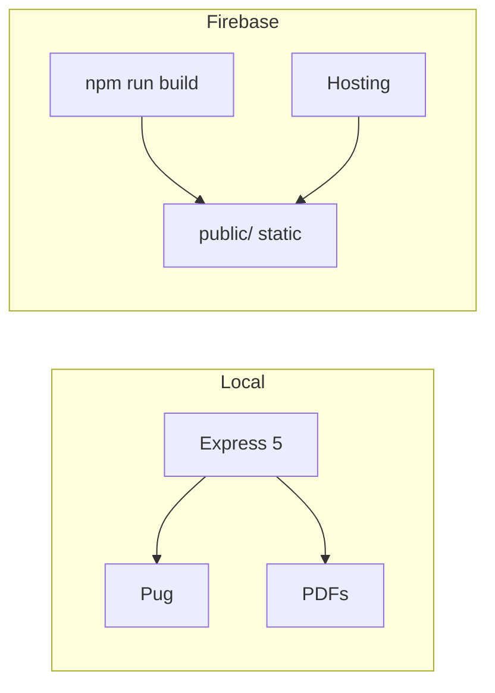

# Platform hardening — Express 5, Firebase static build, Playwright, docs & media

> **Replaces [#31](https://github.com/benmed00/Online-PDF-CV/pull/31)** (merged then reverted on `master`).  
> **Type:** Major enhancement · **Risk:** Medium · **Breaking URL changes:** None  
> **Author:** Jacob Son · **Review focus:** routing, Firebase deploy, CI, security  
> **⚠️ Do not merge without explicit maintainer approval.**

---

## At a glance

|                     |                                                                                                                                                                                         |
| ------------------- | --------------------------------------------------------------------------------------------------------------------------------------------------------------------------------------- |
| **Package**         | `benyakoub-cv@3.6.2`                                                                                                                                                                    |
| **Repo**            | [`benmed00/Online-PDF-CV`](https://github.com/benmed00/Online-PDF-CV) → `master`                                                                                                        |
| **Branch**          | `platform-hardening-and-docs`                                                                                                                                                           |
| **Live demo**       | https://benyakoub-cv.firebaseapp.com/                                                                                                                                                   |
| **Project board**   | [v3.6.2 Platform Hardening (#7)](https://github.com/users/benmed00/projects/7)                                                                                                          |
| **Diff**            | **142 files** · +28,689 / −1,648 lines · **27 commits**                                                                                                                                 |
| **Tests**           | Jest 22+ · Playwright 14 · `npm audit` clean on branch                                                                                                                                  |
| **Maintainer docs** | [`docs/`](https://github.com/benmed00/Online-PDF-CV/tree/platform-hardening-and-docs/docs) · [`wiki/`](https://github.com/benmed00/Online-PDF-CV/tree/platform-hardening-and-docs/wiki) |

---

## What this PR delivers

Turns a conflicted PDF-only Express app into a **production-ready resume platform**:

1. **Runtime** — Express 5, Winston logging, `AppError`, hybrid JSON/HTML errors
2. **Security** — Helmet + CSP, resume slug validation (`/^[a-z0-9-]+$/`)
3. **Production** — `npm run build` static HTML + Firebase rewrites for tools & API
4. **Quality** — Jest + Playwright + GitHub Actions (lint, test, build, e2e)
5. **Docs** — README media, wiki source, maintainer `docs/` hub
6. **Analyzer+** — File upload extraction, optional VirusTotal + OpenAI coach (`65b57fa`)

---

## Linked issues

### Resolved by this PR

Closes #17  
Closes #18  
Closes #19  
Closes #20  
Closes #21  
Closes #22  
Closes #23  
Closes #24

| Issue | Topic                                                      |
| ----- | ---------------------------------------------------------- |
| #17   | Merge conflicts blocked startup                            |
| #18   | Express 5 route syntax / 404 handler                       |
| #19   | Firebase static pages for `/docs`, `/analyzer`, `/compare` |
| #20   | npm audit vulnerabilities                                  |
| #21   | Playwright usability + media                               |
| #22   | CI branch targeting (`main` vs `master`)                   |
| #23   | Centralized logging & error handling                       |
| #24   | Path traversal on `/resume/:version`                       |

### Follow-up (tracked separately — not closed by this PR)

Related to #27 · Related to #28 · Related to #29 · Related to #30

| Issue | Topic                                      |
| ----- | ------------------------------------------ |
| #27   | Firebase PDF fallback when version missing |
| #28   | Sync `wiki/` → GitHub Wiki                 |
| #29   | Unused Firebase client scaffolding         |
| #30   | Automate wiki sync in CI                   |

---

## Before → after

| Area          | `master` today             | This PR                          |
| ------------- | -------------------------- | -------------------------------- |
| App           | Old Express 4 PDF host     | Express 5, conflict-free, tested |
| Home          | Boilerplate / wildcard PDF | Pug + embedded PDF iframe        |
| Tools in prod | N/A on Firebase            | Static build + rewrites          |
| Errors        | Broken / unreachable 404   | `AppError` + structured handler  |
| Security      | No Helmet, traversal risk  | Helmet CSP + slug validation     |
| CI            | Wrong branch / minimal     | Full pipeline + Playwright job   |
| Docs          | Legacy README              | README gallery + wiki + `docs/`  |

---

## Architecture



| Route                          | Purpose           |
| ------------------------------ | ----------------- |
| `/`                            | Home + PDF viewer |
| `/docs` `/analyzer` `/compare` | Tools             |
| `/api/versions`                | JSON version list |
| `/resume` `/resume/:version`   | PDF delivery      |

Details: [`docs/how-it-works.md`](https://github.com/benmed00/Online-PDF-CV/blob/platform-hardening-and-docs/docs/how-it-works.md)

---

## Visual verification

### Home & API docs


### Analyzer & compare

|                                                                         Input                                                                          |                                                                          Results                                                                          |
| :----------------------------------------------------------------------------------------------------------------------------------------------------: | :-------------------------------------------------------------------------------------------------------------------------------------------------------: |
|  |  |

|                                                                   Selectors                                                                    |                                                                   Side-by-side                                                                    |
| :--------------------------------------------------------------------------------------------------------------------------------------------: | :-----------------------------------------------------------------------------------------------------------------------------------------------: |
|  |  |

### Navigation


### Usability videos

| Video        | Link                                                                                                                                                                                                                                                                                |
| ------------ | ----------------------------------------------------------------------------------------------------------------------------------------------------------------------------------------------------------------------------------------------------------------------------------- |
| Home desktop | [home-desktop.webm](https://github.com/benmed00/Online-PDF-CV/blob/platform-hardening-and-docs/docs/assets/videos/home-desktop.webm)                                                                                                                                                |
| Analyzer     | [analyzer-desktop.webm](https://github.com/benmed00/Online-PDF-CV/blob/platform-hardening-and-docs/docs/assets/videos/analyzer-desktop.webm)                                                                                                                                        |
| Compare      | [compare-desktop.webm](https://github.com/benmed00/Online-PDF-CV/blob/platform-hardening-and-docs/docs/assets/videos/compare-desktop.webm)                                                                                                                                          |
| Navigation   | [navigation-desktop.webm](https://github.com/benmed00/Online-PDF-CV/blob/platform-hardening-and-docs/docs/assets/videos/navigation-desktop.webm)                                                                                                                                    |
| Mobile       | [home-mobile.webm](https://github.com/benmed00/Online-PDF-CV/blob/platform-hardening-and-docs/docs/assets/videos/home-mobile.webm) · [navigation-mobile.webm](https://github.com/benmed00/Online-PDF-CV/blob/platform-hardening-and-docs/docs/assets/videos/navigation-mobile.webm) |

---

## Test & CI checklist

| Gate               | Command                         | Status          |
| ------------------ | ------------------------------- | --------------- |
| Unit / integration | `npm test`                      | ✅              |
| Coverage           | `npm run test:coverage`         | ✅              |
| Static build       | `npm run build`                 | ✅              |
| E2E                | `npm run test:e2e`              | ✅ 14 scenarios |
| Full pipeline      | `npm run test:all`              | ✅              |
| Lint / format      | `npm run lint` · `format:check` | ✅              |
| Audit              | `npm audit`                     | ✅ on branch    |

Playwright covers: home, docs, analyzer, compare, API, PDF endpoints, full navigation (desktop + mobile).

---

## How to test locally

```bash
git checkout platform-hardening-and-docs
npm install
npx playwright install chromium
npm run test:all
npm start
# http://localhost:3000
```

Optional analyzer keys: copy `.env.example` → `.env` (VirusTotal, OpenAI).

---

## Reviewer checklist

- [ ] Route order in `app.js`: API → tools → resume → home → static → 404 → error
- [ ] `firebase.json` rewrites match `npm run build` output
- [ ] No secrets in diff (`.env` gitignored)
- [ ] Screenshots/videos OK for public README
- [ ] Explicit approval recorded before merge

---

## Post-merge (maintainer)

- [ ] `SITE_URL=https://benyakoub-cv.firebaseapp.com npm run build` then deploy
- [ ] Sync wiki per [`wiki/Sync-Wiki.md`](https://github.com/benmed00/Online-PDF-CV/blob/platform-hardening-and-docs/wiki/Sync-Wiki.md)
- [ ] Add `CODECOV_TOKEN` secret (optional)
- [ ] Close stale Snyk/Dependabot PRs superseded by Express 5

---

## References

| Resource          | Link                                                                                                                                                                                                                              |
| ----------------- | --------------------------------------------------------------------------------------------------------------------------------------------------------------------------------------------------------------------------------- |
| Testing guide     | [`wiki/Testing-and-Usability.md`](https://github.com/benmed00/Online-PDF-CV/blob/platform-hardening-and-docs/wiki/Testing-and-Usability.md)                                                                                       |
| API reference     | [`wiki/API-Reference.md`](https://github.com/benmed00/Online-PDF-CV/blob/platform-hardening-and-docs/wiki/API-Reference.md)                                                                                                       |
| Roadmap / backlog | [`docs/roadmap.md`](https://github.com/benmed00/Online-PDF-CV/blob/platform-hardening-and-docs/docs/roadmap.md) · [`docs/backlog.md`](https://github.com/benmed00/Online-PDF-CV/blob/platform-hardening-and-docs/docs/backlog.md) |
| Security          | [`SECURITY.md`](https://github.com/benmed00/Online-PDF-CV/blob/platform-hardening-and-docs/SECURITY.md)                                                                                                                           |
| Previous PR       | [#31](https://github.com/benmed00/Online-PDF-CV/pull/31) (superseded)                                                                                                                                                             |
