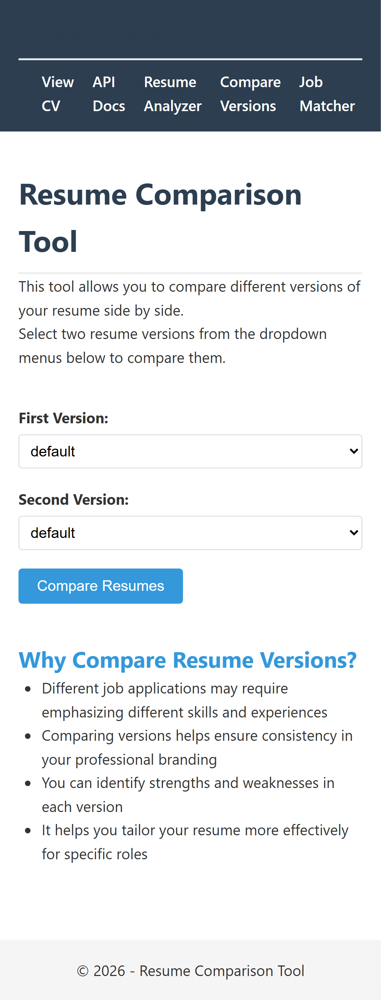
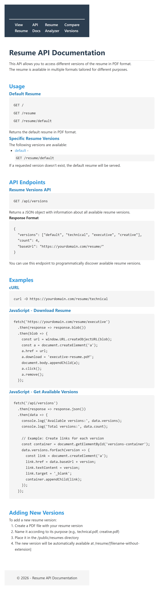
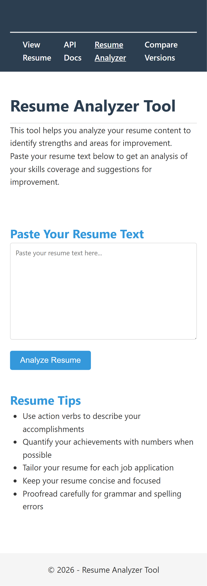
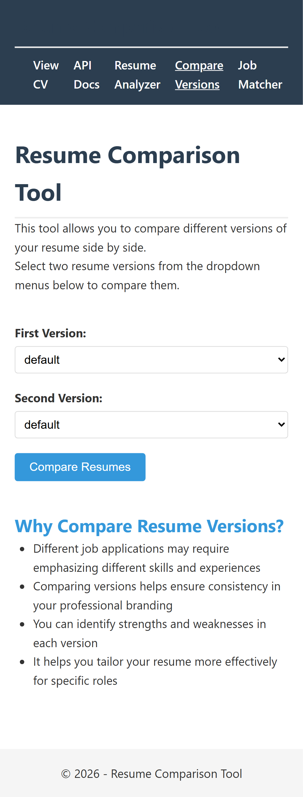
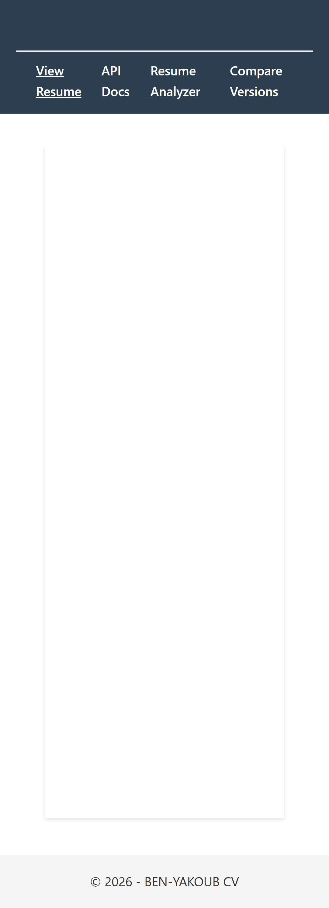

# Online-PDF-CV

A simple and elegant way to host your PDF resume online with Express and Firebase.

**Live demo:** [https://benyakoub-cv.firebaseapp.com/](https://benyakoub-cv.firebaseapp.com/)

**Documentation wiki:** see the [`wiki/`](wiki/Home.md) folder (GitHub Wiki–compatible). Start with [Home](wiki/Home.md) · [Getting Started](wiki/Getting-Started.md) · [Testing & Usability](wiki/Testing-and-Usability.md)

---

## Screenshots

Captured by Playwright usability tests (desktop, 1280×720).

### Home page

Embedded PDF resume with primary navigation.


### API documentation


### Resume analyzer

| Input                                                                           | Results                                                                                       |
| ------------------------------------------------------------------------------- | --------------------------------------------------------------------------------------------- |
|  |  |

### Resume comparison

| Select versions                                                               | Side-by-side PDFs                                                                   |
| ----------------------------------------------------------------------------- | ----------------------------------------------------------------------------------- |
|  |  |

### Navigation flow









---

## Usability videos

WebM recordings from Playwright (desktop and mobile). Stored in [`docs/assets/videos/`](docs/assets/videos/).

| Video                                                                 | Description                    |
| --------------------------------------------------------------------- | ------------------------------ |
| [home-desktop.webm](docs/assets/videos/home-desktop.webm)             | Home page load (desktop)       |
| [analyzer-desktop.webm](docs/assets/videos/analyzer-desktop.webm)     | Analyzer workflow (desktop)    |
| [compare-desktop.webm](docs/assets/videos/compare-desktop.webm)       | Compare tool (desktop)         |
| [navigation-desktop.webm](docs/assets/videos/navigation-desktop.webm) | Full navigation tour (desktop) |
| [home-mobile.webm](docs/assets/videos/home-mobile.webm)               | Home page load (mobile)        |
| [navigation-mobile.webm](docs/assets/videos/navigation-mobile.webm)   | Full navigation tour (mobile)  |

Regenerate screenshots and videos:

```bash
npm run test:all
```

---

## Features

- **Multiple Resume Versions** — `/resume/:version` (technical, executive, creative, …)
- **API Documentation** — interactive page at `/docs`
- **Resume Analyzer** — keyword coverage, best-practice checks, multi-format upload, VirusTotal scan, optional OpenAI coach at `/analyzer`
- **Resume Comparison** — side-by-side PDF view at `/compare`
- **Versions API** — JSON at `/api/versions`
- **Static Firebase build** — `npm run build` pre-renders pages for hosting
- **Testing** — Jest unit tests + Playwright usability tests with screenshots and video
- **CI/CD** — GitHub Actions for lint, test, build, and Firebase deploy

## Technologies

- Node.js · Express 5 · Pug · Firebase Hosting
- Jest · Playwright · ESLint · Prettier · Winston · Helmet

## Quick start

```bash
git clone https://github.com/benmed00/Online-PDF-CV.git
cd Online-PDF-CV
npm install
npm start
```

Open http://localhost:3000

### Analyzer API keys (optional)

Copy `.env.example` to `.env` and set:

- `VIRUSTOTAL_API_KEY` — malware scan on uploaded files (Word, PDF, images, …)
- `OPENAI_API_KEY` — AI Coach tab with strengths, ATS tips, and improvements

Restart the server after changing `.env`. Never commit `.env` to git.

### Add your resume

1. Replace `public/resume.pdf` with your PDF
2. Add versions to `public/resumes/` (e.g. `technical.pdf`)
3. Or use: `npm run add-version -- /path/to/file.pdf technical`

## Scripts

```bash
npm start              # Start server (bin/www)
npm run dev            # Start server (app.js)
npm run build          # Build static HTML for Firebase
npm test               # Jest unit tests
npm run test:coverage  # Jest with coverage
npm run test:e2e       # Playwright usability tests
npm run test:all       # test → build → e2e → publish docs/assets
npm run test:e2e:report  # Open Playwright HTML report
npm run lint           # ESLint
npm run format         # Prettier
npm run deploy         # firebase deploy
npm run add-version    # Add a resume PDF version
npm run generate-sitemap -- https://yourdomain.com
npm run export         # Export resume to json/txt/markdown
```

## Deployment

```bash
npm run build
firebase login
npm run deploy
```

See [wiki/Deployment.md](wiki/Deployment.md) for CI/CD and rewrite rules.

## Documentation

| Resource                             | Topic                                                                                          |
| ------------------------------------ | ---------------------------------------------------------------------------------------------- |
| [`docs/`](docs/README.md)            | **Maintainer hub** — roadmap, backlog, how-it-works, best practices, known issues, maintenance |
| [How to use](docs/how-to-use.md)     | Scripts, deploy, local dev                                                                     |
| [How it works](docs/how-it-works.md) | Architecture and request flow                                                                  |

### Wiki (user guides)

| Wiki page                                              | Topic                          |
| ------------------------------------------------------ | ------------------------------ |
| [Home](wiki/Home.md)                                   | Overview                       |
| [Getting Started](wiki/Getting-Started.md)             | Install and first deploy       |
| [Development](wiki/Development.md)                     | Architecture and scripts       |
| [Testing and Usability](wiki/Testing-and-Usability.md) | Jest, Playwright, media assets |
| [Deployment](wiki/Deployment.md)                       | Firebase Hosting               |
| [API Reference](wiki/API-Reference.md)                 | HTTP endpoints                 |
| [Troubleshooting](wiki/Troubleshooting.md)             | Common issues                  |
| [Sync Wiki](wiki/Sync-Wiki.md)                         | Publish to GitHub Wiki         |

## Contributing

1. Fork the repository
2. Create a feature branch: `git checkout -b feature/my-feature`
3. Run `npm run test:all` before submitting
4. Open a pull request

## License

Apache License 2.0 — see [LICENSE](LICENSE).

## Author

Jacob Son — [ben94med@gmail.com](mailto:ben94med@gmail.com)
