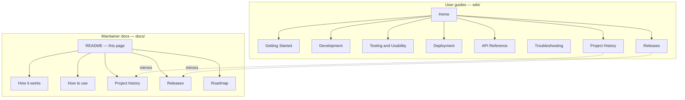

# Online-PDF-CV — Documentation

Project documentation for developers, maintainers, and contributors.

**Live site:** [benyakoub-cv.firebaseapp.com](https://benyakoub-cv.firebaseapp.com/)  
**Version:** 3.6.2  
**Wiki (user guides):** [`wiki/`](../wiki/Home.md)

---

## Documentation map



---

## Start here

| Audience             | Start with                                                             |
| -------------------- | ---------------------------------------------------------------------- |
| New user / fork      | [Wiki: Getting Started](../wiki/Getting-Started.md)                    |
| Developer            | [How to use](how-to-use.md) → [How it works](how-it-works.md)          |
| Contributor          | [Best practices](best-practices.md) → [Backlog](backlog.md)            |
| Historian / reviewer | [Project history](project-history.md) → [Releases](releases/README.md) |

---

## History and releases

| Document                                                                    | Purpose                                                         |
| --------------------------------------------------------------------------- | --------------------------------------------------------------- |
| [Project history](project-history.md)                                       | Full timeline — when, why, and what changed across the refactor |
| [Releases index](releases/README.md)                                        | Tagged releases and milestone summary                           |
| [Release: working-messy-code](releases/working-messy-code.md)               | 2023-06-02 snapshot — minimal Firebase PDF host, broken Express |
| [Release: platform hardening v3.6.2](releases/platform-hardening-v3.6.2.md) | 2026 PR #31 — Express 5, static build, tests, docs              |
| [CHANGELOG](../CHANGELOG.md)                                                | Version-by-version release notes                                |

**Wiki mirrors:** [Project History](../wiki/Project-History.md) · [Releases](../wiki/Releases.md)

---

## Architecture and usage

| Document                            | Purpose                                                     |
| ----------------------------------- | ----------------------------------------------------------- |
| [How to use](how-to-use.md)         | Local dev, deploy, scripts, workflows                       |
| [How it works](how-it-works.md)     | Architecture, request flow, static build, Firebase rewrites |
| [Best practices](best-practices.md) | Coding, security, testing, and deployment conventions       |

---

## Planning and maintenance

| Document                                          | Purpose                                        |
| ------------------------------------------------- | ---------------------------------------------- |
| [Roadmap](roadmap.md)                             | Release phases and planned capabilities        |
| [Backlog](backlog.md)                             | Prioritized work items mapped to GitHub issues |
| [TODOs](todos.md)                                 | Active short-term tasks                        |
| [Known issues](known-issues.md)                   | Documented bugs, gaps, and limitations         |
| [Be aware](be-aware.md)                           | Security, operational, and platform cautions   |
| [Scheduled maintenance](scheduled-maintenance.md) | Recurring upkeep calendar and checklists       |

---

## Wiki (GitHub Wiki source)

The [`wiki/`](../wiki/) folder contains Markdown formatted for [GitHub Wiki](https://github.com/benmed00/Online-PDF-CV/wiki). Publish with [Sync-Wiki.md](../wiki/Sync-Wiki.md).

| Wiki page                                                 | Topic                                      |
| --------------------------------------------------------- | ------------------------------------------ |
| [Home](../wiki/Home.md)                                   | Overview and quick start                   |
| [Getting Started](../wiki/Getting-Started.md)             | Install and first deploy                   |
| [Development](../wiki/Development.md)                     | Architecture and scripts                   |
| [Testing and Usability](../wiki/Testing-and-Usability.md) | Jest, Playwright, media                    |
| [Deployment](../wiki/Deployment.md)                       | Firebase Hosting                           |
| [API Reference](../wiki/API-Reference.md)                 | HTTP endpoints (narrative)                 |
| [OpenAPI guide](openapi.md)                               | JSDoc spec, Swagger UI, traceability (#34) |
| [Troubleshooting](../wiki/Troubleshooting.md)             | Common issues                              |
| [Project History](../wiki/Project-History.md)             | Timeline and refactor                      |
| [Releases](../wiki/Releases.md)                           | Tagged releases                            |
| [Sync Wiki](../wiki/Sync-Wiki.md)                         | Publish wiki to GitHub                     |

---

## Media assets

Screenshots and Playwright usability videos live in [`assets/`](assets/README.md).

Regenerate after UI changes:

```bash
npm run test:all
```

---

## External resources

| Resource              | Location                                                                                        |
| --------------------- | ----------------------------------------------------------------------------------------------- |
| GitHub repository     | [benmed00/Online-PDF-CV](https://github.com/benmed00/Online-PDF-CV)                             |
| GitHub release tag    | [working-messy-code](https://github.com/benmed00/Online-PDF-CV/releases/tag/working-messy-code) |
| Platform hardening PR | [PR #31](https://github.com/benmed00/Online-PDF-CV/pull/31)                                     |
| GitHub issues         | [Issues](https://github.com/benmed00/Online-PDF-CV/issues)                                      |
| Project board         | [v3.6.2 Platform Hardening](https://github.com/users/benmed00/projects/7)                       |

---

## Cross-reference index (A–Z)

| Term                 | Document                                                                                             |
| -------------------- | ---------------------------------------------------------------------------------------------------- |
| Analyzer             | [How to use](how-to-use.md), [API Reference](../wiki/API-Reference.md)                               |
| Architecture         | [How it works](how-it-works.md), [Development](../wiki/Development.md)                               |
| CHANGELOG            | [CHANGELOG.md](../CHANGELOG.md)                                                                      |
| CI/CD                | [How to use](how-to-use.md), [Deployment](../wiki/Deployment.md)                                     |
| Compare tool         | [API Reference](../wiki/API-Reference.md)                                                            |
| Express 5            | [How it works](how-it-works.md), [platform hardening release](releases/platform-hardening-v3.6.2.md) |
| Firebase             | [Deployment](../wiki/Deployment.md), [How it works](how-it-works.md)                                 |
| `working-messy-code` | [Release notes](releases/working-messy-code.md), [Project history](project-history.md)               |
| Playwright           | [Testing and Usability](../wiki/Testing-and-Usability.md)                                            |
| Refactor timeline    | [Project history](project-history.md)                                                                |
| Static build         | [How it works](how-it-works.md), [How to use](how-to-use.md)                                         |
| VirusTotal / OpenAI  | [How to use](how-to-use.md), [Be aware](be-aware.md)                                                 |
