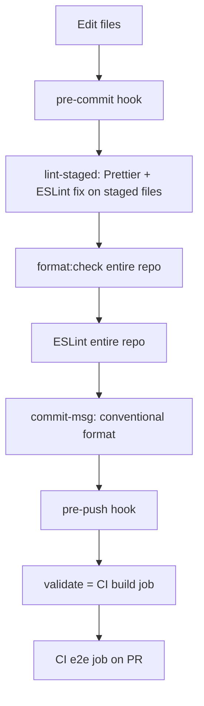

# Best practices

Conventions for developing and maintaining Online-PDF-CV.

---

## Development workflow

1. **Branch from `master`** (or the active release branch) with a descriptive name: `feature/`, `fix/`, `docs/`.
2. **Run locally** before committing:
   ```bash
   npm run precommit    # staged format + full format:check + lint
   npm run validate     # full CI build job parity before push
   ```
3. **Full gate before PR:**
   ```bash
   npm run test:all
   ```
4. **One concern per commit** — infrastructure, features, tests, and docs in separate commits when possible.
5. **Never commit secrets** — `.env`, Firebase keys, tokens. Use environment variables and GitHub Secrets for CI.

---

## Quality gates

Quality checks run in layers — faster checks first, full CI parity before push.



| Layer           | Trigger      | Commands               | Blocks                                  |
| --------------- | ------------ | ---------------------- | --------------------------------------- |
| **Staged fix**  | `git commit` | `lint-staged`          | Unformatted or lint-broken staged files |
| **Repo verify** | `git commit` | `format:check`, `lint` | Drift anywhere in the repo              |
| **Message**     | `git commit` | `commit-msg` hook      | Non-conventional commit subjects        |
| **CI parity**   | `git push`   | `npm run validate`     | Format, lint, audit, coverage, build    |
| **Usability**   | GitHub PR    | `npm run test:e2e`     | Broken pages, PDF routes, analyzer UI   |

### What `validate` runs

Same as the CI **build** job (`npm run validate`):

1. `format:check` — Prettier on the full tree (respects `.prettierignore`)
2. `lint` — ESLint
3. `audit:check` — `npm audit --audit-level=high`
4. `test:coverage` — Jest with thresholds in `jest.config.js`
5. `build` — static site generation + Prettier on build outputs

### Manual commands

| Command                 | Use when                                                      |
| ----------------------- | ------------------------------------------------------------- |
| `npm run format`        | Large doc or HTML changes before committing                   |
| `npm run precommit`     | Re-run the pre-commit hook without committing                 |
| `npm run validate`      | Pre-push sanity check (matches CI build)                      |
| `npm run validate:full` | Local full CI including Playwright                            |
| `npm run test:all`      | Pre-PR: `validate:full` + publish e2e media to `docs/assets/` |

### Hooks and bypass

- Hooks install via `npm install` → `prepare` → Husky
- Emergency bypass only: `git commit --no-verify` / `git push --no-verify`
- `.editorconfig` and `.npmrc` (`engine-strict=true`) align editor and Node version expectations

### Dependency hygiene

- **Dependabot** — weekly npm + GitHub Actions PRs (`.github/dependabot.yml`)
- **npm audit** — enforced at high severity in `validate`; run `npm audit` manually monthly

### Versioning

Package version follows [SemVer](https://semver.org/) and [Conventional Commits](https://www.conventionalcommits.org/):

| Commit type                               | Version bump                             |
| ----------------------------------------- | ---------------------------------------- |
| `feat:`                                   | minor                                    |
| `fix:`, `perf:`, `chore:`, `docs:`, `ci:` | patch (unless no commits since last tag) |
| `feat!:` or `BREAKING CHANGE`             | major                                    |

| Command                                     | When                                                                         |
| ------------------------------------------- | ---------------------------------------------------------------------------- |
| `npm run version:sync`                      | Infer bump from commits since last `v*` tag; update `package.json` if behind |
| `npm run version:check`                     | Fail if `package.json` is lower than required (runs in `validate`)           |
| `npm run version:patch` / `minor` / `major` | Manual bump from current version                                             |

**On merge to `master`:** the [Release version](.github/workflows/release-version.yml) workflow runs `version:sync`, commits `chore(release): vX.Y.Z`, and creates git tag `vX.Y.Z`.

There is **no per-commit version bump** — that would create noisy commits and merge conflicts. Instead, `version:check` enforces the floor before push, and the merge workflow applies the final tag.

---

## Code style

| Tool     | Command          | Notes                                                                                         |
| -------- | ---------------- | --------------------------------------------------------------------------------------------- |
| Prettier | `npm run format` | CI fails on `format:check`                                                                    |
| ESLint   | `npm run lint`   | Warnings on `console.log` in `app.js` startup banner are acceptable; avoid new ones elsewhere |

Match existing patterns:

- CommonJS (`require` / `module.exports`) in server code
- Pug for views; pre-render with `npm run build` for Firebase
- Operational errors → `AppError`; pass to `next(err)`

---

## Security

| Practice                                         | Why                                             |
| ------------------------------------------------ | ----------------------------------------------- |
| Validate resume version slugs (`/^[a-z0-9-]+$/`) | Prevents path traversal on `/resume/:version`   |
| Keep Helmet CSP enabled                          | Limits XSS and iframe abuse                     |
| Do not expose stack traces in production         | Set `NODE_ENV=production`                       |
| Run `npm audit` monthly                          | Track dependency vulnerabilities                |
| Sanitize user input in analyzer API              | Text-only analysis; reject invalid `targetRole` |

---

## Resume content

| Practice                              | Detail                                      |
| ------------------------------------- | ------------------------------------------- |
| Use lowercase slugs                   | `technical`, not `Technical`                |
| One PDF per slug                      | `public/resumes/{slug}.pdf`                 |
| Keep `resume.pdf` as default fallback | Required for home page and Express fallback |
| Optimize PDF size                     | Faster load on mobile; aim under 2 MB       |

---

## Static build & deploy

Always run **`npm run build`** before `firebase deploy`:

```bash
SITE_URL=https://your-production-domain.com npm run build
npm run deploy
```

Without build, Firebase serves stale or missing HTML for `/docs`, `/analyzer`, `/compare`.

---

## Testing

| Layer          | Guideline                                                                                                            |
| -------------- | -------------------------------------------------------------------------------------------------------------------- |
| **Jest**       | Add tests for new routes, utils, and build scripts. Keep e2e out of Jest (`jest.config.js` ignores `/e2e/`).         |
| **Playwright** | Use `getByRole('main')` for headings when layout has duplicates. Prefer `request.get()` for PDF download assertions. |
| **Coverage**   | Core modules in `utils/`, `routes/`, `app.js` — maintain thresholds defined in `jest.config.js`.                     |
| **Media**      | Regenerate `docs/assets/` after UI changes via `npm run test:all`.                                                   |

---

## Git & GitHub

| Practice             | Detail                                                                                   |
| -------------------- | ---------------------------------------------------------------------------------------- |
| Conventional commits | `feat:`, `fix:`, `docs:`, `ci:`, `test:`, `chore:`                                       |
| Link issues          | Reference fork/upstream issue numbers in PR descriptions                                 |
| Fork PRs             | CI runs on fork; upstream checks need maintainer config (see [be-aware.md](be-aware.md)) |
| Labels               | Use `type:`, `priority:`, `area:` labels on fork tracker                                 |

---

## Documentation

| When                | Update                                          |
| ------------------- | ----------------------------------------------- |
| New route or API    | `wiki/API-Reference.md`, `docs/how-it-works.md` |
| New script          | `docs/how-to-use.md`, README                    |
| Known bug           | `docs/known-issues.md`                          |
| Planned work        | `docs/backlog.md`, `docs/roadmap.md`            |
| Operational caution | `docs/be-aware.md`                              |

Keep `docs/` (maintainer reference) and `wiki/` (user-facing guides) in sync where topics overlap.

---

## Performance

- PDF `Cache-Control`: 1 hour on Firebase (`firebase.json` headers)
- Static middleware `{ index: false }` — prevents `public/index.html` from hijacking `/` in Express
- Playwright: single worker locally; retries enabled in CI only

---

## What to avoid

- Express 4 patterns removed in Express 5 (`app.all('*')`, optional route params like `:version?`)
- Committing `logs/*.log` or `node_modules/`
- Hardcoding production URLs outside `SITE_URL` / build script
- Skipping `npm run build` before deploy
- Using numeric separators without ESLint `ecmaVersion` ≥ 2021 (project uses 2022)
- Skipping Husky hooks with `--no-verify` unless absolutely necessary
