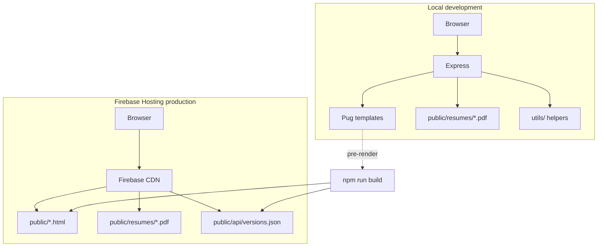

# How it works

Architecture overview for Online-PDF-CV v3.6.2.

---

## High-level picture



---

## Two runtime modes

### 1. Express server (development & Node hosting)

`bin/www` starts Express. `app.js` configures:

| Layer            | Responsibility                                                                         |
| ---------------- | -------------------------------------------------------------------------------------- |
| **Helmet**       | Security headers + CSP (allows PDF iframe on same origin)                              |
| **Winston**      | HTTP request logging                                                                   |
| **Routes**       | Pages, PDF delivery, JSON API                                                          |
| **errorHandler** | JSON for `/api/*`, HTML `error.pug` for browsers                                       |
| **Static files** | `express.static('public', { index: false })` — home route serves Pug, not `index.html` |

Key routes are defined in `app.js` (API, resume PDFs) and `routes/index.js` (tool pages).

### 2. Static hosting (Firebase production)

Firebase serves files from `public/` with **no Node runtime**.

Before deploy, `scripts/build-static.js`:

1. Renders Pug views → `public/index.html`, `public/docs/`, `public/analyzer/`, `public/compare/`
2. Writes `public/api/versions.json` from disk scan of `public/resumes/`

`firebase.json` rewrites:

| Request            | Destination             |
| ------------------ | ----------------------- |
| `/api/versions`    | `/api/versions.json`    |
| `/resume`          | `/resume.pdf`           |
| `/resume/:version` | `/resumes/:version.pdf` |

---

## Resume version discovery

`utils/getResumeVersions.js` scans `public/resumes/` for `*.pdf` files and returns metadata (slug, filename, URL path).

Version slugs are validated by `utils/validateVersion.js`:

```regex
/^[a-z0-9-]+$/
```

Invalid slugs → 400 (API) or 404 (browser).

---

## Request flow — PDF delivery

```
GET /resume/technical
  → isValidVersion('technical') ?
  → fs.existsSync('public/resumes/technical.pdf') ?
  → sendFile OR fallback to resume.pdf (Express only)
```

**Express** falls back to `public/resume.pdf` when a named file is missing.  
**Firebase** returns 404 for missing rewrite targets (see [known-issues.md](known-issues.md)).

---

## Resume analyzer

| Component                            | Role                                                 |
| ------------------------------------ | ---------------------------------------------------- |
| `views/analyzer.pug`                 | UI shell                                             |
| `public/javascripts/analyzer-app.js` | Client-side form + fetch                             |
| `utils/resumeAnalyzer.js`            | Keyword scoring, suggestions                         |
| `POST /api/analyze`                  | Server endpoint (also used by static page via fetch) |

Target roles: `engineering`, `management`, `general`.

---

## Error handling

```
Operational error (AppError)
  → statusCode + message
  → /api/*  → JSON { success, message }
  → browser → render error.pug (stack in development only)

Unknown error
  → 500, logged via Winston
```

Process-level hooks in `bin/www` exit on uncaught exceptions and unhandled rejections.

---

## Testing layers

| Layer              | Tool             | Scope                                         |
| ------------------ | ---------------- | --------------------------------------------- |
| Unit / integration | Jest + Supertest | Routes, utils, build script                   |
| End-to-end         | Playwright       | Full pages, navigation, PDF endpoints         |
| CI                 | GitHub Actions   | format → lint → test → build → coverage → e2e |

Playwright starts the app via `webServer: npm start` during tests.

---

## CI/CD pipelines

| Workflow                            | Trigger                                          | Purpose           |
| ----------------------------------- | ------------------------------------------------ | ----------------- |
| `ci.yml`                            | push/PR to `master`, feature branch push, manual | Quality gates     |
| `firebase-hosting-merge.yml`        | push to `master`                                 | Production deploy |
| `firebase-hosting-pull-request.yml` | PR (same repo only)                              | Preview channel   |

Fork PRs to upstream may not show CI checks until upstream enables fork workflow runs (see [be-aware.md](be-aware.md)).

---

## Directory map

```
Online-PDF-CV/
├── app.js                 # Express app, API, PDF routes
├── bin/www                # HTTP server + crash hooks
├── routes/index.js        # Tool page routes
├── views/                 # Pug templates
├── utils/                 # logger, errors, resume helpers, analyzer
├── public/                # Static assets + build output
├── scripts/               # build-static, add-version, export, …
├── __tests__/             # Jest
├── e2e/                   # Playwright
├── .github/workflows/     # CI/CD
├── docs/                  # This documentation set
└── wiki/                  # GitHub Wiki source
```

---

## Related documentation

| Document                                                             | Topic                            |
| -------------------------------------------------------------------- | -------------------------------- |
| [Documentation index](README.md)                                     | Full docs hub                    |
| [Project history](project-history.md)                                | Timeline and refactor context    |
| [Release: working-messy-code](releases/working-messy-code.md)        | Pre-refactor architecture (2023) |
| [Release: platform hardening](releases/platform-hardening-v3.6.2.md) | Current era release notes        |
| [How to use](how-to-use.md)                                          | Scripts and workflows            |
| [Wiki: Development](../wiki/Development.md)                          | GitHub Wiki mirror               |
