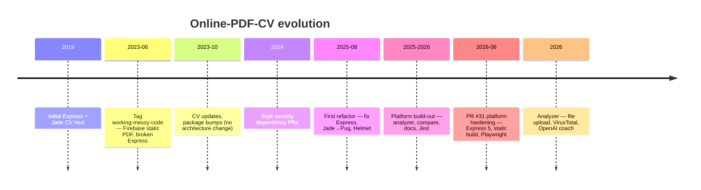

# Project history

Timeline of Online-PDF-CV from the initial Express PDF host through the platform hardening refactor. This document explains **when** major changes happened, **why** they were made, and **what** the objectives were.

**Related:** [Releases index](releases/README.md) · [CHANGELOG](../CHANGELOG.md) · [Roadmap](roadmap.md) · [Wiki: Project History](../wiki/Project-History.md)

---

## At a glance

| Era                 | Approx. dates       | Codebase size | Production model                    |
| ------------------- | ------------------- | ------------- | ----------------------------------- |
| Origins             | 2019–2023           | ~22 files     | Firebase static HTML + embedded PDF |
| Dormant maintenance | Oct 2023 – Jul 2024 | ~22 files     | Same                                |
| First refactor      | Aug 2025            | ~80 files     | Express serves pages correctly      |
| Platform            | 2025–2026           | ~260 files    | Express dev + Firebase static build |

---

## Phase 0 — Origins (2019–2023)

**Objective:** Host a personal PDF CV online with minimal tooling.

- **2019-07-02** — Initial commits. Basic Express app with Jade templates.
- **2020–2022** — Periodic CV PDF updates, Dependabot security bumps, Heroku references in README (later replaced by Firebase).
- **2023-06-02** — Ten commits in one day: favicon, Google Tag, Firebase deploy fixes, CI build script. Tagged [`working-messy-code`](releases/working-messy-code.md).

### State at `working-messy-code`

The tag name is deliberate: production **worked** on Firebase, but Express was **messy**:

- 22 files, 6 npm dependencies
- Firebase rewrites all routes to `public/index.html` with `<embed src="resume.pdf">`
- Express had unmounted routers, a `app.get('*')` wildcard returning PDF for every path, and unreachable 404 handling
- Jade views existed but were unused in production

See the full [working-messy-code release notes](releases/working-messy-code.md).

---

## Phase 1 — Maintenance only (Oct 2023 – Jul 2024)

**Objective:** Keep the live CV current; no architectural ambition.

| Date       | Change                                                                               |
| ---------- | ------------------------------------------------------------------------------------ |
| 2023-10-02 | CV update (English), README corrections, Firebase cache, package updates             |
| 2024-07-23 | CV 2024 update                                                                       |
| 2024-09-18 | [PR #10](https://github.com/benmed00/Online-PDF-CV/pull/10) — Snyk Express 4.18→4.20 |
| 2025-07-18 | [PR #14](https://github.com/benmed00/Online-PDF-CV/pull/14) — Snyk morgan upgrade    |

The application architecture remained the 22-file Firebase static host. Express bugs persisted.

---

## Phase 2 — First refactor (Aug 2025)

**Objective:** Fix broken Express foundations; modernize stack basics.

**Trigger:** Fork work on `ben-git-code/Online-PDF-CV` with [PR #1](https://github.com/ben-git-code/Online-PDF-CV/pull/1) and [PR #2](https://github.com/ben-git-code/Online-PDF-CV/pull/2) (_Enhance, Refactor, and Optimize Application_).

| Change                                  | Rationale                                    |
| --------------------------------------- | -------------------------------------------- |
| Remove `app.get('*')` PDF wildcard      | Stop serving PDF for `/docs`, `/api/*`, etc. |
| Mount `indexRouter` with `app.use('/')` | Actually use defined routes                  |
| Jade → Pug                              | Jade deprecated; rename to Pug               |
| Add Helmet                              | Security headers for HTTP responses          |
| ES6 module style in app                 | Align with modern Node conventions           |
| Dependency upgrades                     | Reduce known vulnerabilities                 |

After this phase, `npm start` served a real Express home page instead of only static files or raw PDF.

---

## Phase 3 — Platform build-out (2025–2026)

**Objective:** Evolve from “PDF host” to “resume platform” with tools recruiters and developers can use.

**Key commit:** `6b84509` — _Add resume export and analysis features_ (~70 files, +11,800 lines).

| Capability                   | Added                                         |
| ---------------------------- | --------------------------------------------- |
| Multi-version PDFs           | `/resume/:version`, `public/resumes/`         |
| Versions API                 | `GET /api/versions`                           |
| Documentation page           | `/docs`                                       |
| Resume analyzer              | `/analyzer` with keyword scoring              |
| Resume comparison            | `/compare` side-by-side viewer                |
| Export / sitemap / templates | Scripts under `scripts/`                      |
| Testing                      | Jest, ESLint, Prettier, CI workflow           |
| SEO / PWA                    | `robots.txt`, `manifest.json`, service worker |

Documented in [CHANGELOG](../CHANGELOG.md) under Version 4.0.0 feature wave.

A second infrastructure pass (`ceaca50`, `07d2374`) added Winston logging and centralized error handling.

---

## Phase 4 — Platform hardening (2026)

**Objective:** Make the platform production-ready, testable, and deployable on Firebase without a Node runtime.

**Delivery:** [PR #31](https://github.com/benmed00/Online-PDF-CV/pull/31) — _Platform hardening: Express 5, Firebase static build, Playwright usability, docs & media_.

| Goal                       | Implementation                                         |
| -------------------------- | ------------------------------------------------------ |
| Resolve merge conflicts    | Clean `app.js`, `package.json`, views                  |
| Express 5 compatibility    | Explicit routes; no `*` or invalid optional params     |
| Firebase production parity | `npm run build` pre-renders Pug → `public/*.html`      |
| Security                   | Helmet CSP, version slug validation, `npm audit` clean |
| Quality gates              | 22 Jest + 14 Playwright tests, CI on `master`          |
| Documentation              | README media gallery, `wiki/`, `docs/` maintainer hub  |

Full release notes: [platform-hardening-v3.6.2.md](releases/platform-hardening-v3.6.2.md).

---

## Phase 5 — Analyzer enhancements (2026, ongoing)

**Objective:** Extend the analyzer from paste-only text to uploaded files with optional cloud integrations.

**Commit:** `65b57fa` — file upload extraction, VirusTotal scan, OpenAI coach.

| Feature             | Route / config                                                   |
| ------------------- | ---------------------------------------------------------------- |
| Multi-format upload | Word, PDF, images via `multer` + `officeparser` / `tesseract.js` |
| Malware scan        | VirusTotal API (`VIRUSTOTAL_API_KEY`)                            |
| AI coach tab        | OpenAI API (`OPENAI_API_KEY`)                                    |
| Config endpoint     | `GET /api/analyzer/config`                                       |

See [how-to-use.md](how-to-use.md#analyzer-api-keys-optional) and [API Reference](../wiki/API-Reference.md).

---

## Refactor objectives (summary)

Three layered goals drove all phases after `working-messy-code`:

### 1. Fix broken foundations

The release-era Express layer could not serve pages correctly. Routers were dead code; the wildcard route masked every path as a PDF download. The first refactor made Express a viable development server.

### 2. Evolve product scope

From a single static PDF to a toolkit:

- Multiple resume versions for different audiences (technical, executive, …)
- Self-service API documentation
- Analyzer and compare tools for job seekers
- Export and SEO utilities

### 3. Production and maintainability

- Static build so Firebase Hosting serves tools without Node
- Automated tests and CI
- Structured logging and error handling
- Documented architecture for contributors

---

## Before vs after (technical)

| Area                | `working-messy-code`     | Current                        |
| ------------------- | ------------------------ | ------------------------------ |
| `app.js` lines      | ~40, wildcard bug        | ~250, explicit routes          |
| View engine         | Jade (unused)            | Pug with layout + nav          |
| `GET /docs`         | Returns PDF              | Returns HTML docs page         |
| `GET /api/versions` | Returns PDF              | Returns JSON                   |
| Firebase deploy     | Static `index.html` only | Built pages + rewrites         |
| Tests               | 0                        | 22 Jest + 14 Playwright        |
| Documentation       | Basic README             | `docs/`, `wiki/`, media assets |

---

## Fork and upstream relationship

| Repository                                                                  | Role                                                               |
| --------------------------------------------------------------------------- | ------------------------------------------------------------------ |
| [benmed00/Online-PDF-CV](https://github.com/benmed00/Online-PDF-CV)         | Canonical upstream; live Firebase deploy                           |
| [ben-git-code/Online-PDF-CV](https://github.com/ben-git-code/Online-PDF-CV) | Development fork; origin of PR #1/#2 refactor and PR #31 hardening |

Commit `4909eda` established `benmed00/Online-PDF-CV` as the canonical repository.

---

## Related documentation

### Maintainer docs (`docs/`)

| Document                         | Topic                |
| -------------------------------- | -------------------- |
| [Documentation index](README.md) | Full docs hub        |
| [Releases](releases/README.md)   | Tagged releases      |
| [How it works](how-it-works.md)  | Current architecture |
| [Roadmap](roadmap.md)            | Future phases        |
| [Known issues](known-issues.md)  | Current gaps         |

### Wiki (GitHub Wiki source)

| Page                                          | Topic                       |
| --------------------------------------------- | --------------------------- |
| [Project History](../wiki/Project-History.md) | This timeline (wiki format) |
| [Releases](../wiki/Releases.md)               | Release index               |
| [Development](../wiki/Development.md)         | Local workflow              |
| [Deployment](../wiki/Deployment.md)           | Firebase deploy             |

### External

| Resource              | URL                                                                                             |
| --------------------- | ----------------------------------------------------------------------------------------------- |
| GitHub release tag    | [working-messy-code](https://github.com/benmed00/Online-PDF-CV/releases/tag/working-messy-code) |
| Platform hardening PR | [PR #31](https://github.com/benmed00/Online-PDF-CV/pull/31)                                     |
| First refactor PR     | [PR #1 (fork)](https://github.com/ben-git-code/Online-PDF-CV/pull/1)                            |
